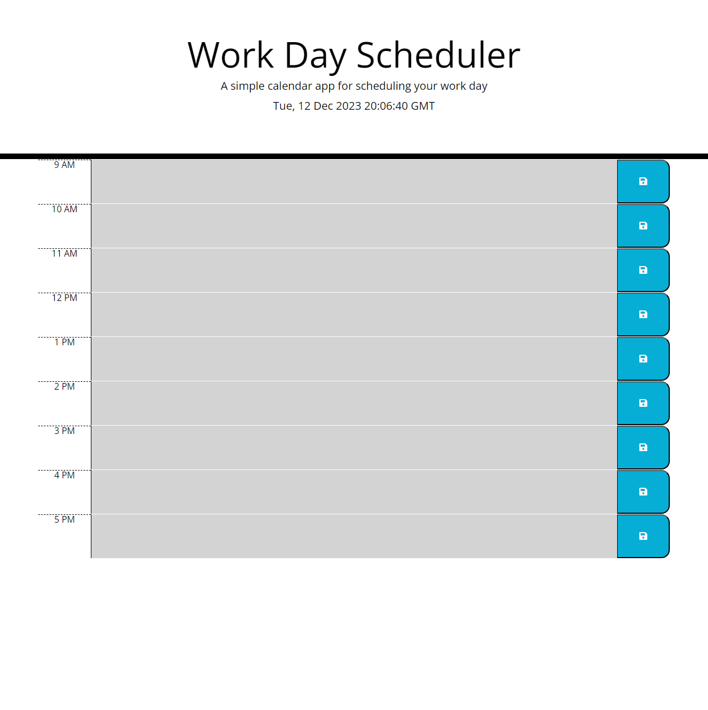

# Work Day Scheduler

## Description

Work Day Scheduler with color coded time blocks and the ability to save tasks for the usual working day.

## Table of Contents

* [Installation](#installation)
* [Usage](#usage)
* [Credits](#credits)
* [License](#license)
* [Badges](#badges)

## Installation

N/A

## Usage 

Go To: [codrincarpovici.github.io/work-day-scheduler/](https://codrincarpovici.github.io/work-day-scheduler/) and view the website. 

Once on the website you can view the currrent date and time at the top of the page. You will then see a scheduler with different timeblocks below it containing working hours(9AM to 5PM). You have the option to type in a task, click the save button and have it persist between page refreshes. The time blocks will also be color coded based on what the current time of day is to represent past present and future through grey, red and green respectively.

## Credits

N/A

## License

## Badges

